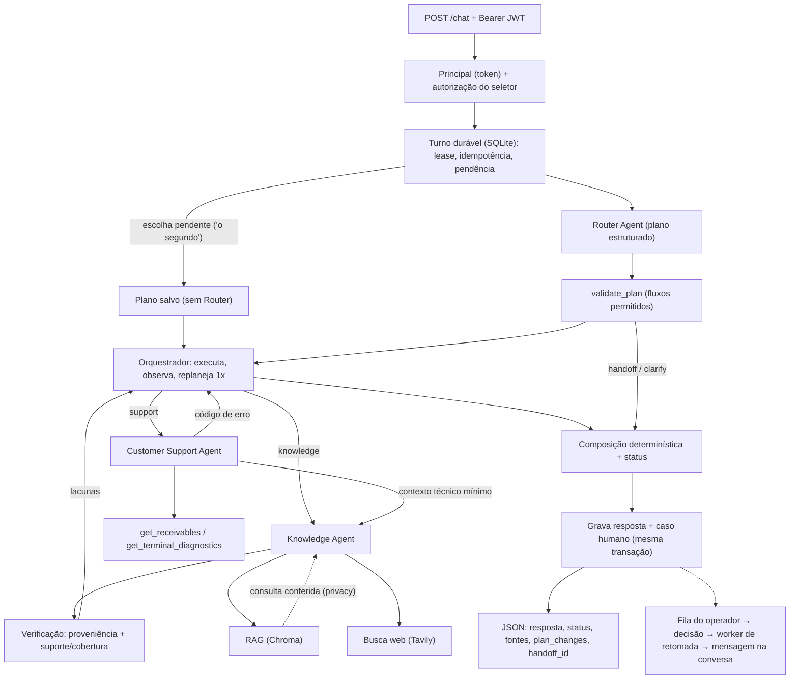

# Getnet Multi-Agent Support

Serviço HTTP em que **três agentes cooperam** para responder mensagens de clientes da Getnet:

| Agente | Papel |
|---|---|
| **Router** | Lê a mensagem (com o histórico da conversa como dado) e escolhe um fluxo permitido (`knowledge`, `support`, `support_then_knowledge`, `combined`, `clarify`, `handoff`). |
| **Knowledge** | Responde perguntas públicas com **RAG** sobre páginas oficiais da Getnet (Chroma) e **busca web** (Tavily) para perguntas gerais (clima, câmbio). |
| **Customer Support** | Consulta dados **individuais** do cliente com duas ferramentas: `get_receivables` e `get_terminal_diagnostics`. |

Ideia central: **o LLM interpreta e escolhe ferramentas; o código controla identidade, sequência de execução, evidências e limites.** Cada resposta carrega as fontes que a sustentam, e os valores financeiros vêm da ferramenta, não da geração.

Em volta dos agentes: **identidade por JWT** com autorização por recurso, **conversa durável** (SQLite) com escolha em dois turnos e idempotência, **verificação** de cada afirmação antes de `answered`, **replanejamento limitado** depois de observar resultados, **caso humano real** com fila de operador e retomada na conversa, e **operação** de uma instância (prontidão, desligamento, saturação, privacidade das consultas externas).

**Link do vídeo da v2:** {{LINK_VIDEO_V2}} (vídeo da v1: https://youtu.be/ro0qdh9WJQE)

> **Revisão v2.** Esta versão responde ao feedback da v1 (7,9/10). A matriz **crítica → implementação → teste → evidência** está em [`docs/evidence/README.md`](docs/evidence/README.md); decisões em [`docs/adr/`](docs/adr/); operação em [`docs/runbook.md`](docs/runbook.md); roteiro de demonstração em [`docs/demo.md`](docs/demo.md). A especificação de comportamento está em [`spec.md`](spec.md).

## Autoavaliação com a rubrica de vocês

Estimativa nossa, conservadora, para quem avalia conferir contra a evidência. A nota v1 é a do feedback.

| Critério | Peso | Nota v1 (de vocês) | Nota v2 (nossa estimativa) | Evidência |
|---|---|---|---|---|
| Business Fit | 8% | 9,5 | **9,5** | fluxos do enunciado inalterados; `evals/cases.json` (17 casos) |
| Agentic | 15% | 7,2 | **8,0** | replanejamento limitado a 1 mudança por pedido: [`app/replanning.py`](app/replanning.py), [`tests/test_replanning.py`](tests/test_replanning.py), ADR 0004. Não é um planejador aberto |
| RAG | 10% | 8,5 | **8,5** | recuperação medida, não melhorada: [`retrieval-labeling.md`](docs/evidence/retrieval-labeling.md) (Recall@5 0,91; inglês 0,78) |
| Tools | 10% | 9,3 | **9,3** | ferramentas sem identidade nos argumentos, valores renderizados pelo servidor: [`tests/test_regressions.py`](tests/test_regressions.py) |
| Security | 13% | 6,0 | **8,0** | JWT → `Principal`, autorização antes do LLM, escopos: [`tests/test_auth.py`](tests/test_auth.py), [`tests/test_operations.py`](tests/test_operations.py). Na demo o emissor é o de desenvolvimento; a validação por JWKS de produção existe, mas não foi testada com um IdP real |
| Memory | 8% | 1,5 | **7,0** | conversa durável, escolha em dois turnos, follow-up autocontido: [`tests/test_conversations.py`](tests/test_conversations.py), [`tests/test_followup.py`](tests/test_followup.py), x17 (o pronome é resolvido nas 3 rodadas, mas o caso falha porque foi mal rotulado). Uma instância só |
| Human Oversight | 7% | 2,5 | **7,0** | caso real, fila, claim/resolve versionados, retomada: [`tests/test_handoffs.py`](tests/test_handoffs.py), x16, `demo.txt`. Sem tela de operador |
| Evaluation | 14% | 8,7 | **8,8** | scorer sem falso positivo, 3 rodadas, métricas de recuperação, revisão semântica: [`docs/evidence/`](docs/evidence/README.md). Revisão semântica não independente |
| Observability | 6% | 7,5 | **7,5** | logs JSON com allowlist, `/ready`: [`app/observability.py`](app/observability.py). Sem traces, painéis nem alertas |
| Production Eng | 5% | 8,8 | **9,0** | CI testa dentro da imagem, smoke e SIGTERM; drills de saturação e falhas: [`drills.json`](docs/evidence/drills.json) |
| Engineering Judgment | 4% | 9,5 | **9,5** | ADRs 0001–0005, limites declarados |
| **Média ponderada** | 100% | 7,2 | **8,3** | |

A média ponderada das notas da v1 com esses pesos dá 7,2, não os 7,9 informados; a diferença pode vir de um ajuste da banca que não conhecemos. Por isso a comparação justa é critério a critério. Os maiores saltos estimados são Memory e Human Oversight, que na v1 praticamente não existiam. RAG fica igual: a recuperação foi medida, não melhorada.

## Como testar em 2 minutos

> **`/chat` exige token.** Sem `Authorization: Bearer`, a resposta é 401. Na demo, `POST /dev/token` emite tokens dos principais de desenvolvimento (só com `APP_ENV=development`, o padrão do `docker compose`).

Com o `.env` preenchido e o índice já criado (a primeira vez, rode antes `docker compose build` e a ingestão de [Como executar](#como-executar), que levam mais que 2 minutos):

```bash
docker compose up -d && curl -s localhost:8000/ready          # {"status":"ready", ...}
TOKEN=$(curl -s -X POST localhost:8000/dev/token -H 'Content-Type: application/json' -d '{"sub":"user-a"}' \
  | python -c "import sys,json;print(json.load(sys.stdin)['access_token'])")
curl -s -X POST localhost:8000/chat -H "Authorization: Bearer $TOKEN" -H 'Content-Type: application/json' \
  -d '{"message":"Quando recebo minhas vendas de ontem?"}' | python -m json.tool
python scripts/demo.py --base-url http://localhost:8000 --restart   # 21 cenários, com reinício do container no meio
```

## Estado da verificação

Evidência final no commit limpo `6ae47f2` ([manifesto](docs/evidence/release-manifest.json)), em 25/11/2026. Os relatórios registram o commit sem `-dirty`: a documentação foi escrita depois das rodadas.

| Verificado | Resultado |
|---|---|
| Suíte offline (`pytest`, sem rede nem chaves), no host e dentro da imagem `test` | **328 passed**; ruff, format e mypy limpos |
| Smoke na imagem da API construída (CI e local) | OK: `/health`, `/ready` com checks, 401 sem token, 403 antes do Router; `docker stop` registra o fechamento dos clientes |
| Demo ponta a ponta contra a API real, com reinício do container no meio da conversa (`scripts/demo.py --restart`) | **21/21 passos** ([saída](docs/evidence/demo.txt)) |
| Avaliação real (`gpt-6-luna`, 17 casos), **3 rodadas no mesmo commit** | **15/17, 13/17, 13/17**, 0 erros; rota, ferramentas, fontes esperadas, valores e afirmações proibidas em 100% nas três ([agregado](docs/evidence/eval-summary.json)) |
| Métricas de recuperação (27 consultas rotuladas, índice atual) | Recall@5 0,91, MRR 0,87, nDCG@5 0,84; inglês 0,78 contra português 0,98 ([métricas](docs/evidence/retrieval-labeling.md)) |
| Revisão semântica | nenhuma afirmação sem fonte; D4 e D5 corrigidos, D2 corrigido nos textos fixos, D1 e D3 abertos ([revisão](docs/evidence/semantic-review.md)) |
| Falhas provocadas (`scripts/drills.py`) | saturação → 503 imediato; chave inválida → 503 em 0,5 s sem retry; índice ausente → `/ready` 503; SIGTERM com pedido em curso → o pedido termina ([drills](docs/evidence/drills.json)) |

As verificações com serviços reais ficam marcadas `@pytest.mark.live` e exigem `.env`.

## Como executar

Pré-requisitos: Docker (ou Python 3.11), uma chave OpenAI e uma chave Tavily.

```bash
cp .env.example .env          # PowerShell: Copy-Item .env.example .env
                              # preencha OPENAI_API_KEY, TAVILY_API_KEY e OPENAI_CHAT_MODEL
docker compose build
docker compose run --rm api python -m app.ingest   # baixa as páginas oficiais e cria o índice (volume chroma_data)
docker compose up                                   # API em http://localhost:8000
```

Em seguida, abra `http://localhost:8000/docs` (Swagger) ou use os exemplos abaixo. Para parar: `Ctrl+C` (ou `docker compose down`; o índice permanece no volume).

**Porta 8000 ocupada?** A porta do host é configurável:
```bash
API_PORT=8011 docker compose up            # PowerShell: $env:API_PORT=8011; docker compose up
```

**Ingestão falha com `permission denied` ou o índice parece corrompido?** Provavelmente há um volume antigo de outra versão da imagem. Recrie-o: `docker compose down -v` e rode a ingestão de novo.

| Variável | Para quê |
|---|---|
| `OPENAI_API_KEY` | chat com tool calling e embeddings (obrigatória) |
| `OPENAI_CHAT_MODEL` | modelo de chat com tool calling e saída estruturada (obrigatória) |
| `OPENAI_REASONING_EFFORT` | opcional. Modelos de raciocínio (ex.: `gpt-6-luna`) só aceitam ferramentas no Chat Completions com `none`; deixe vazio para modelos que rejeitam o parâmetro (ex.: `gpt-4o`) |
| `OPENAI_EMBEDDING_MODEL` | padrão `text-embedding-3-small` |
| `TAVILY_API_KEY` | busca web; sem ela o Knowledge responde só com RAG e informa a lacuna em perguntas gerais |
| `CHROMA_PATH` | onde o índice é persistido (no Docker: `/data/chroma`, volume nomeado) |

A imagem da API roda como usuário sem privilégios e tem `HEALTHCHECK` em `/health`. A API recusa iniciar, com mensagem clara, se `OPENAI_API_KEY` ou `OPENAI_CHAT_MODEL` faltarem. Se o índice estiver ausente, `GET /health` mostra `"index": "missing"` e perguntas que exigem RAG devolvem 503 `index_unavailable`.

### Exemplo

`/chat` exige um token. Na demo (`APP_ENV=development`, padrão do `docker compose`), o emissor local entrega tokens para os principais de desenvolvimento:

```bash
TOKEN=$(curl -s localhost:8000/dev/token -H 'content-type: application/json' -d '{"sub": "user-a"}' \
  | python -c 'import json,sys; print(json.load(sys.stdin)["access_token"])')
curl -s localhost:8000/chat -H 'content-type: application/json' -H "Authorization: Bearer $TOKEN" \
  -d '{"message": "When will the money from yesterday'\''s sales be deposited?", "user_id": "cliente1988"}'
```

```jsonc
{
  "request_id": "req_ab12cd34ef56",
  "status": "answered",            // answered | partial | needs_clarification | insufficient_evidence | handoff_opened | handoff_recommended | customer_not_found
  "answer": "Recebíveis das vendas de 06/11/2026 (dados demonstrativos):\n- Venda R-1988-001: R$ 1.250,00, liquidação em 07/11/2026, status: previsto ...",
  "agents_used": ["router", "customer_support"],
  "sources": [{"id": "R-1988-001", "type": "customer_record", "title": "Recebível R-1988-001", "url": null}],
  "data_mode": "demo",             // "demo" quando dados sintéticos de cliente foram usados
  "workflow": "support",           // campos extras, úteis para depuração e avaliação
  "tools_used": ["get_receivables"],
  "conversation_id": "conv_…",     // envie de volta para continuar a conversa (T04)
  "run_id": "run_…",
  "run_status": "completed",       // "awaiting_operator" quando um caso humano foi aberto (status handoff_opened)
  "handoff_id": null,
  "plan_changes": []               // ex.: ["knowledge_repair"], ["guidance_added"] (T07)
}
```

Clientes sintéticos: `cliente1988` (recebíveis previstos + terminal offline com `ADQ 1-19` e última transação recusada), `cliente2000` (outros recebíveis + 2 terminais funcionando). Principais de desenvolvimento: `user-a` → `cliente1988`, `user-b` → `cliente2000`, `user-c` → `desconhecido` (autorizado, sem cadastro → `customer_not_found` nas perguntas de dados individuais) e `operator-1` (operador, sem estabelecimento). `user_id` é só um seletor: precisa ser um estabelecimento do token, senão 403.

### Erros HTTP

| Código | Quando |
|---|---|
| 401 `unauthorized` | token ausente, inválido, expirado, de outro emissor/audiência ou sem `tenant_id` — o LLM nem é chamado |
| 403 `forbidden` | `user_id` que não pertence ao principal (mesma resposta para cliente existente ou não) — o LLM nem é chamado |
| 403 `insufficient_scope` | o Router escolheu o Support, mas o token não tem escopo de dados do cliente |
| 400 `customer_selection_required` | principal com mais de um estabelecimento sem `user_id` |
| 404 `not_found` | `conversation_id` inexistente, de outro principal/cliente ou expirada |
| 409 | `conversation_busy` (outro turno da conversa em andamento), `idempotency_key_reused` (mesma chave, outro conteúdo), `request_in_progress`, `conversation_conflict` |
| 422 | payload inválido (mensagem vazia/gigante, `user_id` fora de `^[A-Za-z0-9_-]{1,64}$`) — o LLM nem é chamado |
| 503 `llm_unavailable` | provedor de LLM falhou de forma persistente (1 retry com pausa) ou devolveu saída fora do schema duas vezes |
| 503 `index_unavailable` | índice ausente/incompatível numa pergunta que exige RAG |
| 500 `internal_error` | erro inesperado (JSON, sem detalhes internos; o tipo do erro vai para o log) |
| 503 `budget_exceeded` | limite de chamadas (LLM/ferramentas) esgotado **sem nenhum resultado parcial** |
| 503 `overloaded` | mais `/chat` simultâneos do que `MAX_CONCURRENT_CHATS` no processo; resposta imediata com `Retry-After: 2` |
| 504 `deadline_exceeded` | prazo (40 s) esgotado **sem nenhum resultado parcial** — com resultado parcial a resposta é `partial` |

### Desenvolvimento local e testes

```bash
python -m venv .venv && .venv/Scripts/activate        # Linux/macOS: source .venv/bin/activate
pip install -r requirements-dev.txt
python -m ruff check . && python -m ruff format --check . && python -m mypy app && python -m pytest   # verificação única
python -m pytest -m live                              # verificações reais (exigem .env)
docker compose --profile test run --rm tests          # a mesma suíte, no Docker
python scripts/smoke.py --base-url http://localhost:8000   # smoke contra um container no ar (sem LLM)
```

## Arquitetura


```mermaid
flowchart TD
    A["POST /chat + Bearer JWT"] --> P["Principal (token) + autorização do seletor"]
    P --> ST["Turno durável (SQLite): lease, idempotência, pendência"]
    ST -->|"escolha pendente ('o segundo')"| PL["Plano salvo (sem Router)"]
    ST --> R["Router Agent (plano estruturado)"]
    R --> V["validate_plan (fluxos permitidos)"]
    PL --> O
    V --> O["Orquestrador: executa, observa, replaneja 1x"]
    O -->|knowledge| K["Knowledge Agent"]
    O -->|support| S["Customer Support Agent"]
    S -->|"contexto técnico mínimo"| K
    K --> VER["Verificação: proveniência + suporte/cobertura"]
    VER -->|"lacunas"| O
    S -->|"código de erro"| O
    K --> D["RAG (Chroma)"]
    K --> W["Busca web (Tavily)"]
    D -.->|"consulta conferida (privacy)"| K
    S --> T["get_receivables / get_terminal_diagnostics"]
    O --> C["Composição determinística + status"]
    V -->|"handoff / clarify"| C
    C --> ST2["Grava resposta + caso humano (mesma transação)"]
    ST2 --> J["JSON: resposta, status, fontes, plan_changes, handoff_id"]
    ST2 -.-> H["Fila do operador → decisão → worker de retomada → mensagem na conversa"]
```

### Fluxo de mensagens

1. `POST /chat` valida o token (RS256, emissor, audiência, validade) e monta o `Principal`; confronta o `user_id` com os estabelecimentos do principal (resolvidos no servidor) e só então cria um `RequestContext` por requisição (cliente autorizado, escopos, relógio, orçamento, evidências). Não existe `current_user_id` global.
2. O **Router** faz uma chamada estruturada (sem ferramentas e sem a identidade do cliente). O **código** valida o plano: fluxo permitido, ordem e agentes corretos, no máximo 2 tarefas. Plano inválido → 1 nova tentativa → `clarify`.
3. O orquestrador executa o fluxo **em sequência**. Agentes não se chamam: o código passa objetos tipados.
   - `support_then_knowledge`: o Support consulta o diagnóstico; só `terminal_model`, `error_code` e `issue` seguem ao Knowledge (nunca ids, valores ou identidade).
   - `combined`: duas subperguntas independentes; cada ramo é isolado — se um falha, a parte válida sai com `status="partial"` e uma nota de pendência.
4. Depois de cada etapa o orquestrador **observa** o resultado e pode mudar o plano uma vez (`app/replanning.py`): reparar as lacunas que o verificador apontou ou acrescentar a orientação oficial para um código de erro visto no diagnóstico. As mudanças saem em `plan_changes`.
5. A composição é determinística (seções por especialista). O status final segue regras explícitas (`merge_status`).
6. O turno é gravado no SQLite com a resposta, a pendência (ex.: lista de terminais apresentada) e, se o fluxo escalou, o caso humano, tudo na mesma transação. O próximo turno da conversa usa esse estado; o operador decide pela API e um worker entrega a resposta humana na conversa.

### Como as ferramentas (tool calling) são usadas

- Cada agente roda um loop (`run_agent`): o LLM chama ferramentas até devolver uma **saída estruturada** (`AgentOutput`).
- Ferramentas são `ToolSpec` com `args_model` Pydantic **`extra="forbid"`**, enviadas ao OpenAI em modo **strict** (`pydantic_function_tool`): o LLM só escolhe o que a ferramenta declara, e campos opcionais vão como `null` explícito. A identidade do cliente **não é argumento** — vem de `ctx.user_id`. Um tool call com `user_id` extra é rejeitado antes de executar.
- Nome desconhecido, argumentos inválidos ou orçamento de ferramentas esgotado voltam ao LLM como resultado de erro, sem derrubar a requisição. Se as rodadas de ferramentas acabam, uma chamada final **sem ferramentas** força a resposta com o que já foi coletado.
- Toda ferramenta devolve `ToolResult` com `status`, dados tipados e **evidências** (`id`, `type`, `title`, `url`). O servidor registra as evidências da requisição; o LLM só **seleciona ids**, e URLs/títulos finais vêm dos metadados. Ids inventados são descartados.

### Pipeline de RAG

1. **Ingestão** (`python -m app.ingest`, comando separado da API): lê `data/sources.json` → baixa cada URL (timeout, falhas registradas) → extrai o conteúdo principal (trafilatura, sem menu/rodapé) → *chunking* (~700 tokens estimados, sobreposição de ~80, perguntas de FAQ ficam junto da resposta) → embeddings OpenAI → persiste no Chroma. Repetível: reingerir substitui os chunks da URL e **remove do índice as páginas retiradas de `sources.json`** (uma página que apenas falhou nesta rodada mantém os chunks antigos). Sem `OPENAI_API_KEY` sai com código 2 antes de baixar qualquer página. Trocar `OPENAI_EMBEDDING_MODEL` exige índice novo: `docker compose down -v` (apaga o volume) e ingerir de novo. Imprime resumo (páginas ok, falhas, chunks); sai com erro só se **nenhuma** página entrar.
2. **Armazenamento**: Chroma persistente (volume Docker). Cada chunk guarda `chunk_id`, `source_url`, `title`, `market`, `language`, `fetched_at`, `content_hash`. Um `manifest.json` registra modelo e dimensão dos embeddings; consultar com outro modelo é recusado (`incompatible`).
3. **Recuperação**: `retrieve_getnet_knowledge(query, market, topic)` → `top_k=5`, filtrando por mercado. A distância vetorial **não** é exposta como "confiança".
4. **Geração**: o Knowledge responde só com o que os trechos sustentam, preserva condições e limitações, cita ids de evidência e declara a lacuna quando não há suporte (`insufficient_evidence`). Conteúdo recuperado é tratado como **dado**, nunca como instrução.

**Fontes** (`data/sources.json`, 25 páginas): FAQ oficial, páginas de produto (Get Clássica, aluguel/planos, Get Smart, Get Lite), Pix, Get Conta, antecipação, erros de maquininha (ADQ 1-19), Wi-Fi, status de vendas, crediário, Link de Pagamento/WhatsApp e a página global sugerida no enunciado (`getnet.net/en`, mercado `global`). Todas foram sondadas com HTTP real e conteúdo extraído ≥ 500 caracteres.
Notas: o enunciado sugere o site global, mas os cenários são brasileiros, então o corpus é majoritariamente `site.getnet.com.br`. A página `/maquininha/get-smart/` é renderizada por JavaScript (quase sem texto extraível), então informações da Get Smart vêm de outras páginas (FAQ, soluções Get Smart, planos). Páginas coletadas numa data podem trazer ofertas antigas — por isso o prompt manda avisar que condições podem mudar.

## Decisões e trade-offs

- **Sem LangGraph**: fluxo pequeno e explícito em funções async é mais fácil de depurar e explicar; a arquitetura lógica valeria igual com um grafo.
- **Composição e status em código**: evita uma chamada extra de LLM. O bloco de recebíveis é um template com os dados da ferramenta, e o texto livre do LLM é trocado por uma nota fixa se afirmar pagamento/confirmação de um recebimento que a ferramenta não marca como `pago` (verificação por padrões, em PT e EN: é uma salvaguarda forte, não uma prova semântica).
- **Execução sequencial**: simples e previsível; paralelizar o `combined` é uma otimização futura.
- **Chroma local**: zero serviços extras para a demo; para múltiplas instâncias, trocar por um vetor store gerenciado (a interface `KnowledgeIndex` isola isso).
- **Identidade pelo token, acesso pelo servidor**: o JWT diz quem chama; o mapa principal → estabelecimentos é do servidor, e o `user_id` do payload é só um seletor conferido contra ele. Em desenvolvimento um emissor local (chave efêmera) assina tokens pelo mesmo caminho criptográfico; produção exige um provedor de identidade (JWKS) e recusa o emissor local. Sem sistema próprio de senhas.
- **Conversa em SQLite**: uma instância basta ao escopo, sem servidor de banco. O turno grava a intenção, executa sem transação aberta e grava o resultado conferindo a versão; a escolha "o segundo" é resolvida pelo servidor contra a lista que ele mesmo apresentou, nunca pelo LLM.
- **Estimativa de tokens (~4 caracteres/token)** no *chunking*, para não depender de baixar um tokenizador.
- Fixtures de clientes usam **offsets de data** para que "ontem" funcione em qualquer dia da demo.

## Guardrails e confiabilidade

- Validação de entrada antes de qualquer chamada ao LLM; identidade só no `RequestContext`; o repositório filtra por esse contexto e terminais de outro cliente nunca são revelados.
- Plano do Router validado pelo código; limites por requisição configuráveis (≤2 especialistas, ≤10 chamadas LLM incluindo retry, verificação e replanejamento, ≤5 ferramentas, ≤2 buscas web, deadline 40 s).
- **Replanejamento limitado** (`app/replanning.py`): depois de cada etapa o código observa o resultado e pode mudar o plano uma vez: reparar as lacunas apontadas pelo verificador (`knowledge_repair`) ou acrescentar a orientação oficial para um código de erro visto no diagnóstico (`guidance_added`). Só começa se sobrar orçamento para concluir e verificar; sem evidência nova, mantém o que já foi comprovado (`knowledge_repair:no_progress`). A resposta lista as mudanças em `plan_changes`.
- Evidências verificadas pelo servidor; sem evidência validada → `insufficient_evidence` **e o texto do LLM é descartado** (resposta fixa "não encontrei nas fontes"), para não vazar condição comercial vinda da memória do modelo.
- Falhas de um ramo viram `partial`. O encaminhamento humano acontece quando há **problema técnico diagnosticado e nenhuma orientação oficial** (`support_then_knowledge`): `status=handoff_opened` com `handoff_id` quando o caso real foi aberto, `handoff_recommended` quando é só orientação (principal sem `handoffs:create`). O pedido explícito de "falar com um atendente" também abre o caso (fluxo `handoff`). Pelo `/chat`, o turno abre um **caso interno real** (fila, operador, decisão auditável) e devolve `handoff_id` com `run_status=awaiting_operator`; depois da decisão, um worker entrega a resposta do atendente na própria conversa, identificada como resposta humana. Terminal ambíguo vira `needs_clarification`.
- Busca web recebe só consulta pública (sem dados do cliente); logs não contêm mensagem, resposta nem `user_id`.

## Estratégia de testes

Pirâmide pensada para um sistema multiagente, onde o LLM é a parte não determinística:

1. **Integração da API até a resposta**, com um LLM *roteirizado* (`ScriptedLLM`) e fakes de embeddings/busca/relógio. Verifica contratos, roteamento, ferramentas, isolamento entre clientes, fluxo composto, falhas e limites **sem custo e sem flakiness**. Cada critério de aceite da spec tem um teste (`tests/test_api.py`, `tests/test_orchestrator.py`), e cada item da revisão v2 tem o seu arquivo: `test_auth.py`, `test_conversations.py`, `test_handoffs.py`, `test_verification.py`, `test_replanning.py`, `test_operations.py` (este com canários de privacidade num fluxo completo).
2. **Unidade das peças determinísticas**: chunking, índice, ferramentas, validação de plano, template de recebíveis, cliente OpenAI (com stub).
3. **Verificações reais separadas** (`-m live`, exigem `.env`): ingestão, embeddings, recuperação, Tavily.
4. **Avaliação de IA** (abaixo) para o que testes determinísticos não alcançam: qualidade de roteamento e de resposta com o modelo real.

5. **Imagem e operação**: o CI roda a suíte dentro da imagem, faz smoke (`scripts/smoke.py`) e SIGTERM no container da API; `scripts/demo.py` percorre os cenários contra a API real (com reinício no meio) e `scripts/drills.py` provoca saturação, provedor fora, índice ausente e SIGTERM com pedido em curso.

Para ampliar: gravar/reproduzir respostas reais do provedor (VCR) para regressão barata e carga com volume real para calibrar os limites.

## Avaliação de IA

`evals/cases.json` traz **17 casos**: as 10 mensagens do enunciado + composta, terminal ambíguo, produto inexistente (sem evidência), cliente desconhecido, tentativa de troca de usuário, pedido explícito de atendente e um follow-up com pronome em dois turnos (`setup_messages`). Cada caso define rota, ferramentas obrigatórias e permitidas (qualquer outra reprova), fontes aceitáveis, status, valores ligados ao seu status, valores monetários permitidos, âncoras semânticas e afirmações proibidas; listas vazias ficam fora do denominador e erros de requisição contam como falha. Cada execução grava um relatório JSON por caso em `evals/reports/`.

```bash
docker compose up -d
python -m evals.run_evals            # imprime PASS/FAIL por caso e as métricas
python -m evals.summarize evals/reports/run-A.json evals/reports/run-B.json ...   # agrega rodadas
python -m evals.retrieval_metrics    # métricas de recuperação do índice (só embeddings)
```

Métricas: acerto de rota, de ferramentas, de fontes esperadas, de status, preservação de valores e ausência de afirmações proibidas. A pontuação detecta regressões objetivas; a **qualidade semântica** é revisada à parte (abaixo). Evolução natural: um avaliador semântico independente com rubrica calibrada.

**Resultado final (25/11/2026, commit limpo `6ae47f2`, API no Docker, `gpt-6-luna`), 3 rodadas:**

| Métrica | Rodada 1 | Rodada 2 | Rodada 3 |
|---|---|---|---|
| casos | 15/17 | 13/17 | 13/17 |
| rota | 17/17 | 17/17 | 17/17 |
| ferramentas | 17/17 | 17/17 | 17/17 |
| fontes esperadas | 7/7 | 7/7 | 7/7 |
| status | 14/16 | 12/16 | 12/16 |
| valores, valores permitidos e afirmações proibidas | 100% | 100% | 100% |

Estáveis em 3/3: e01, e02, e03, e06, e08, e09, e10, x12, **x13 (produto inexistente → `insufficient_evidence`)**, x14, x15 e **x16 (`handoff_opened`)**. Variam: e04 e e07 (2/3), x11 (1/3). Falham nas três:

- **x17 (follow-up com pronome):** a memória funciona. O Router reescreveu "E como eu ativo ele?" como "Como ativar o modo quiosque da Get Smart" nas três rodadas, mas a página oficial não traz os passos e a resposta sai `partial`, corretamente. Foi a expectativa do caso que rotulamos errado; não a trocamos depois de ver o resultado.
- **e05 (maquininha não conecta):** os passos do ADQ 1-19 aparecem com fonte, mas o verificador cobra passos gerais de conexão que o índice não tem.

Todo erro de status é para o lado conservador (`partial` ou `insufficient_evidence`), nunca texto sem fonte.

A pontuação não mede tudo: a [revisão semântica](docs/evidence/semantic-review.md) lê as respostas. Ela encontrou os defeitos D1–D5. D4 e D5 foram corrigidos com regressões. D2 foi corrigido nos textos fixos, mas o texto gerado pelo modelo ainda mistura idiomas às vezes. D1 e D3 seguem abertos.

**Histórico:** na v1 o placar foi 14/15 com um scorer mais leniente, que aprovava o x13 falhando. Os relatórios por caso da v1 não foram guardados, então o scorer v2 não foi rodado contra ela. Na primeira rodada final da v2 (`6b7df82`, 16 casos) o placar foi 12/16, 14/16 e 14/16.

## Observabilidade e monitoramento em produção

Implementado: logs JSON estruturados com **allowlist de campos** (campo desconhecido é descartado; ids de recebíveis e diagnósticos não são logados, pois embutem o número do cliente), uma linha por evento (`route`, `tool_call`, `agent_completed`, `agent_failed`, `replan`, `public_query_refused`, `overloaded`, `request_completed`, `request_failed`, `shutdown`) com `request_id`, `workflow`, `agent`, `tool_name`, `status`, `duration_ms`, `source_ids`, `index_version`, consumo agregado (`llm_calls`, `tool_calls`, `web_searches`, `embedding_calls`, `token_usage`) e `error_code`. `GET /health` (liveness) e `GET /ready` (índice, estado e ciclo de vida, 503 quando não pronto). Consultas que saem para busca web ou embeddings passam por uma checagem de dados do cliente (`app/privacy.py`). O CI roda a suíte dentro da imagem e faz smoke e SIGTERM no container da API construído.

Descrito (não implementado): painéis de latência p50/p95 por fluxo e por agente, taxa de `partial`/`insufficient_evidence`/`customer_not_found`, custo por requisição (tokens), taxa de 503/504; traces distribuídos (OpenTelemetry) com um span por agente/ferramenta; alertas em picos de `llm_unavailable`, queda de `index: ready`, aumento de `insufficient_evidence` (sinal de índice defasado) e do deadline; reexecução periódica dos `evals` como teste de regressão do modelo e dos prompts.

## Como estender

- **Nova ferramenta**: criar o `args_model` (`extra="forbid"`, sem identidade) e a função `async (args, ctx) -> ToolResult`, registrar como `ToolSpec` em `build_customer_tools` ou `build_knowledge_tools`, e acrescentar teste em `tests/`.
- **Novo fluxo**: adicionar o valor em `Workflow` (`app/schemas.py`), a regra em `validate_plan` (`app/agents/router.py`), a execução em `_run_workflow` (`app/orchestrator.py`), a descrição no `ROUTER_SYSTEM` (`app/prompts.py`) e um caso em `evals/cases.json`.
- **Nova fonte de conhecimento**: acrescentar a URL em `data/sources.json` e rodar a ingestão.
- **Dados reais de clientes**: implementar `CustomerRepository` (`app/repositories.py`) e injetar em `build_deps` (`app/main.py`).

## Custo e tempo de desenvolvimento

Tokens e custo foram medidos nos logs locais das sessões do Claude Code (uso registrado por chamada ao modelo, contando cada chamada uma vez), em 25/11/2026. O custo é calculado com o **preço público da API** para esses tokens.

| Versão | Tempo | Tokens do Claude | Custo equivalente (US$) |
|---|---:|---:|---:|
| v1 (entrega avaliada com 7,9) | não registrado | ≈ 56,7 milhões | ≈ 16,03 |
| v2 (revisão T01–T10 e a rodada de correções) | ≈ 5 h de sessão ativa, de 22 a 25/11 | ≈ 139,9 milhões | ≈ 51,70 |
| **Total** | — | **≈ 196,6 milhões** | **≈ 67,73** |

- **Tempo da v2:** soma dos intervalos de até 15 minutos entre eventos da sessão; pausas mais longas contam como paradas. Não inclui leitura fora da sessão nem a gravação do vídeo. O tempo da v1 não foi cronometrado na época.
- **Quase tudo é leitura de cache:** a conversa é reenviada a cada passo e vem do cache (≈ 97% dos tokens). Os tokens novos (entrada, saída e escrita de cache) somam ≈ 2,1 milhões na v1 e ≈ 2,2 milhões na v2.
- **Não estão incluídos:** o custo de *executar* a aplicação (chamadas à OpenAI e ao Tavily nos testes, `evals` e demonstrações).

### Detalhe por versão

**v1:** uma sessão do Claude Code com **Claude Sonnet 5.5** (`claude-sonnet-5-5`), 2 subagentes Sonnet 5.5 (revisão da spec e revisão final) e o Claude Haiku 5.5 em 2 buscas web.

**v2:** uma sessão do Claude Code com **Claude Opus 5.5** (`claude-opus-5-5`), sem subagentes.

| Item | v1: Sonnet 5.5 | v2: Opus 5.5 |
|---|---:|---:|
| Chamadas ao modelo | 219 | 586 |
| Entrada não cacheada | 490 | 1.200 |
| Saída (inclui raciocínio) | 398.047 | 578.064 |
| Escrita de cache, 5 min | 197.738 | 0 |
| Escrita de cache, 1 h | 1.519.695 | 1.571.781 |
| Leitura de cache | 54.505.442 | 137.785.017 |
| **Tokens** | **56.621.412** (+ 38.337 do Haiku) | **139.936.062** |
| **Custo equivalente** | **US$ 16,01** (+ ≈ 0,02 do Haiku) | **US$ 51,70** |

Tarifas por milhão de tokens:

| Modelo | Entrada | Saída | Leitura de cache | Escrita de cache, 5 min | Escrita de cache, 1 h |
|---|---:|---:|---:|---:|---:|
| Sonnet 5.5 | US$ 2 | US$ 10 | US$ 0,10 | US$ 2,50 | US$ 4 |
| Opus 5.5 | US$ 4 | US$ 20 | US$ 0,20 | US$ 5 | US$ 8 |

As tarifas do Sonnet reproduzem os checkpoints de custo que o próprio Claude Code gravou na sessão da v1. A primeira versão desta seção mostrava ≈ 49,4 milhões e US$ 14,25 para a v1 porque foi escrita antes do fim daquela sessão.

## Semana 1 dentro da Getnet

**Rollout gradual, por fluxo.** Cada fluxo (`knowledge`, `support`, `support_then_knowledge`, `combined`, `handoff`) avança sozinho, só depois de 24 h estáveis no degrau anterior:

1. **Shadow** (dias 1–2): o sistema responde em paralelo ao atendimento atual, sem chegar ao cliente; a equipe compara amostras e calibra os limites.
2. **5%** (dia 3): começando por `knowledge` (só informação pública), depois `support`.
3. **25%** (dias 4–5): inclui `support_then_knowledge` e `handoff`, com operadores reais na fila.
4. **100%** (a partir do dia 6, por fluxo), mantendo o desligamento por fluxo.

**Métricas monitoradas** (por fluxo, janela de 1 h):

| Métrica | De onde vem | Alvo inicial |
|---|---|---|
| Respostas com afirmação sem evidência | verificação + amostragem humana | **0** |
| Resposta financeira divergente da ferramenta | comparação do texto com `get_receivables` | **0** |
| Taxa de `insufficient_evidence` e `partial` | `request_completed.status` | referência do shadow |
| Taxa de handoff (`handoff_opened` + `handoff_recommended`) | `request_completed.status` | referência do shadow |
| p95 de latência | `duration_ms` | ≤ 20 s |
| Custo por pedido | `token_usage`, `llm_calls`, `web_searches` | referência do shadow |
| 503 e 504 | logs `overloaded`, `request_failed` | < 1% |

**Critério objetivo de desligar ou voltar um degrau** (automático, por fluxo):

- qualquer resposta financeira divergente da ferramenta, ou qualquer afirmação sem fonte confirmada pela amostragem → desliga o fluxo na hora;
- `insufficient_evidence` acima de 2 vezes a taxa do shadow por 1 h (sinal de índice defasado ou consulta quebrada) → volta um degrau;
- 503/504 acima de 2% por 15 min, ou p95 acima de 30 s por 30 min → volta um degrau;
- fila humana com casos vencidos (`handoff_expired`) → congela o avanço do `handoff`.

Os alvos são pontos de partida, não medidos em produção; o shadow serve justamente para trocá-los por números reais.


## Limitações conhecidas

O que **não** foi entregue ou tem limite conhecido (cada item foi observado, não suposto):

- **Autenticação é de demonstração.** Na demo, o emissor de tokens é local e efêmero (`POST /dev/token`, só com `APP_ENV=development`, chave RSA gerada no processo). Fora de desenvolvimento a API já recusa esse emissor e valida RS256 pelo JWKS configurado (`AUTH_ISSUER`, `AUTH_JWKS_URL` em https, `AUTH_AUDIENCE`), mas isso nunca foi testado contra um IdP real. Com o IdP da Getnet (OIDC) faltaria:
    - apontar essas três variáveis para ele;
    - mapear as claims de `tenant_id`, papel e escopos que o IdP emitir;
    - trocar o mapa principal → estabelecimentos (`JsonAccessRepository`, fixture) pelo cadastro real.

    `Principal`, a autorização antes do LLM e os escopos por ferramenta não mudam (ADR 0001).
- **Uma instância.** SQLite, o worker de retomada (no mesmo processo da API) e o limite de simultaneidade valem por processo. Várias instâncias exigem trocar o `StateStore` (Postgres) e mover o worker para uma fila (ADRs 0002 e 0003).
- **Sem tela de operador.** O ciclo humano é exercido pela API e por `scripts/demo.py`.
- **Defeitos ainda abertos da revisão semântica:**
    - **D1, data da fonte não checada:** uma página de médias mensais pode sustentar uma previsão. Correção sugerida: passar o tipo e a data da página ao verificador, ou criar uma regra no prompt de clima.
    - **D3, seções que não se conversam:** o Suporte diz que não há como corrigir, e o Conhecimento mostra a correção logo abaixo. Correção sugerida: conciliar o texto livre na composição.
    - **D2, parcial:** os textos fixos seguem o idioma da pergunta, mas as lacunas descritas pelo verificador e o texto do reparo ainda saem às vezes em português.
- **Avaliação semântica não independente.** A revisão das respostas foi feita pelo agente que implementou; não há juiz calibrado com humanos. Variação do verificador: 13 a 15 de 17 no mesmo commit, sempre para o lado conservador.
- **Carga medida pequena.** Foram 6 pedidos simultâneos numa instância: isso prova o comportamento sob saturação, não a capacidade.
- **Recuperação medida, não melhorada** (gap 7 do feedback). Em 27 consultas rotuladas, Recall@5 0,91 e MRR 0,87, mas as consultas em inglês recuperam pior (0,78) e a FAQ ocupa a maior parte do top 5 ([métricas](docs/evidence/retrieval-labeling.md)). O índice é o mesmo da v1 (25 páginas, 41 chunks), e a rotulagem não teve segundo revisor.
- **Recusa 51 sem caso humano.** Quando o Conhecimento sai `partial` (define "venda negada", mas sem orientação para o código), o caso não é aberto.
- **Observabilidade básica.** Há logs JSON com allowlist e `request_id`; não há traces distribuídos, painéis nem alertas (descritos acima, não implementados).
- **Privacidade por padrões.** A checagem das consultas externas cobre os valores vistos no pedido e padrões conhecidos; um formato novo de dado pessoal exige atualizar os padrões.
- **Dados sintéticos.** Clientes e acessos vêm de fixtures; produção exige o cadastro real atrás de `CustomerRepository` e `AccessRepository`.
- **Limites não calibrados.** Deadline, orçamentos, simultaneidade, `top_k` e tamanho de chunk são pontos de partida.
- O filtro que impede o LLM de afirmar "pago/confirmado" é por padrões (pt/en) e conservador. Páginas renderizadas por JavaScript não são extraídas.
